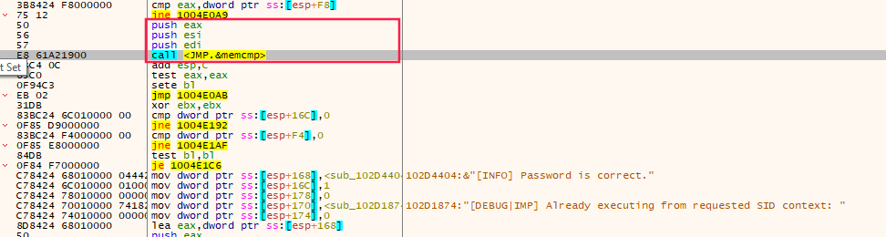
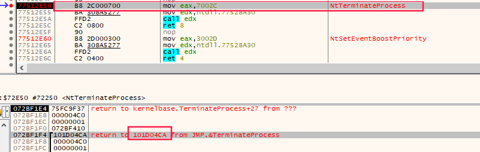
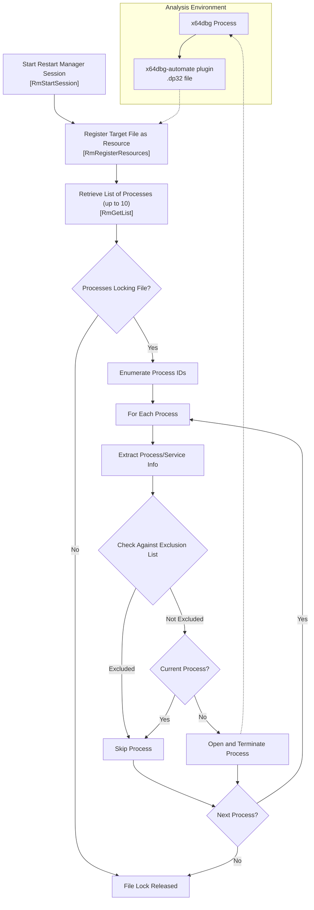
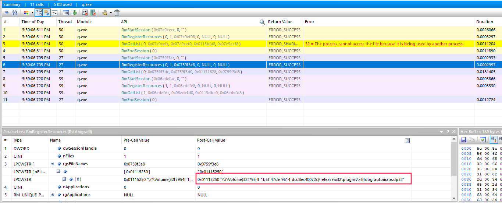
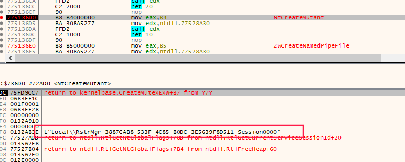

# From x64dbg Automation to Restart Manager Abuse:  

## Abstract
This article documents a dynamic analysis of **Qilin ransomware**, focusing on bypassing a password-based execution gate using **x64dbg** debugger automation.

What started as a straightforward attempt to automate a known bypass using **x64dbg-automate** unexpectedly evolved into an investigation of **Windows Restart Manager**, which the ransomware abused to forcibly terminate the debugger itself.

The write-up follows the full analysis path - from manual patching, to automation, to OS-level interference - highlighting the importance of understanding both malware logic and Windows internals.

---

## Background
Qilin ransomware sample analyzed in this research requires a valid password to proceed with execution.

The password is supplied via the command line using the `--password` parameter and validated at runtime by comparing:
- a **hardcoded SHA-256 hash**
- with the SHA-256 hash of the user-supplied password

Because multiple Qilin samples exhibited the same protection mechanism, automating the bypass became a necessity.

> [!IMPORTANT]
> Qilin samples are packed and unpack their payload dynamically at runtime. Static on-disk patching would be ineffective without prior unpacking. A memory-based debugger approach enables analysis of the actual execution flow without modifying the packed binary.
---

## Analysis Environment

* **SHA-256**(sample): 1e52d9f04f99be66d5bc13db767c6acb5f0515906633f76e5c713681af9454df
- **OS:** Windows 10 (VMWare Workstation 17)
- **Debugger:** x64dbg
- **Disassembler**: IDA
- **Automation Plugin:** x64dbg-automate  
- **API monitor**: Rohitab

---

## Part 1. Manual Password Check Bypass

### Password Validation Logic
At runtime, Qilin computes the SHA-256 hash of the supplied password and compares it with a hardcoded reference value.

This comparison is performed using `msvcrt!memcmp`.


```
memcmp(user_hash, hardcoded_hash, 0x40)
```

### Manual Hash Replacement

As a first step, the hardcoded hash was manually replaced in memory to match the computed hash.

> **Result:** The sample proceeded to the main execution logic.

## Part 2. Motivation for Automation

### Why Automation Was Required

- multiple Qilin samples
- identical password validation logic
- repetitive manual patching was inefficient

The goal was to:

- automatically intercept the comparison
- replace the hardcoded hash at runtime
- let execution continue without manual interaction

## Part 3. Automating the Bypass with x64dbg-automate

### Overview of the Automation Approach

The automation strategy was simple and based on:

1. Breaking on `msvcrt!memcmp`
2. Detecting comparison of exactly `0x40` bytes (SHA-256 hash length)
3. Copying the hardcoded hash over the computed one

This effectively forces the comparison to succeed.

### Automation Script Overview

The automation was implemented using Python and the `x64dbg-automate` client.

**Note:** The full script is available by the following link 
#### Session #1. x64dbg Configuration

The first debugger session is used **only** to modify x64dbg settings.

Key actions:

- disable TLS callbacks
- disable system breakpoints
- extend exception ignore ranges

```python
client.set_setting_int('Events', 'TlsCallbacks', 0) client.set_setting_int('Events', 'TlsCallbacksSystem', 0) client.set_setting_int('Events', 'SystemBreakpoint', 0)

old = client.get_setting_str("Exceptions", "IgnoreRange")
new = old + ",000006BA-000006BA:second:log:debuggee"
client.set_setting_str("Exceptions", "IgnoreRange", new)
```

This session is terminated immediately after configuration.

> **Important:** These settings must be applied before the actual debugging session begins.

#### Session #2.  Runtime Bypass Logic

The second session performs the actual automation.

1. Break on `msvcrt!memcmp`
	```python
	client.cmd_sync("bp msvcrt.memcmp")
	```

2. Apply a conditional breakpoint:
	```python
	bpcnd msvcrt.memcmp, arg.get(2)==40
	```
  
3. Resume execution
	```python
	client.go()
	```
		
4. When the breakpoint is hit: copy memory from the hardcoded hash buffer to the computed  one:
	```python
	client.wait_until_stopped()
	client.cmd_sync("memcpy arg.get(0), arg.get(1), arg.get(2)")
    ```

> **Effect:** The comparison always succeeds.

### Expected Outcome

At this point, the automation logic was correct and equivalent to the manual bypass.
However, execution did **not** proceed as expected.

## Part 4. Unexpected Termination of x64dbg

### Observed Behavior

During automation:

- x64dbg closed abruptly    
- the debugged process terminated as well
- no obvious crash or exception was visible

This suggested **external interference** rather than a script error.

## Part 5. Investigating the Termination Cause

### Breaking on Process Termination

To understand why **x64dbg was abruptly terminated**, I set a breakpoint on the native API responsible for process termination:

`NtTerminateProcess`



The breakpoint was consistently hit shortly before the debugger exited.
The relevant code path resolved to the following instruction sequence:

```nasm
.text:101D04A7                 mov     eax, [esp+20Ch+var_1C8]
.text:101D04AB                 mov     ecx, [esp+20Ch+var_1D0]
.text:101D04AF                 mov     [esp+20Ch+lpMem], ecx
.text:101D04B3                 mov     [esp+20Ch+hObject], eax
.text:101D04B7                 mov     [esp+20Ch+var_198], edi
.text:101D04BB                 push    1               ; uExitCode
.text:101D04BD                 push    [esp+210h+hProcess] ; hProcess
.text:101D04C1                 mov     ebx, [esp+214h+var_1D8]
.text:101D04C5                 call    TerminateProcess
.text:101D04CA                 test    eax, eax
```

This code belongs to the following function:
```nasm
.text:101D0100 ; int __cdecl sub_101D0100(int, DWORD dwProcessId)
.text:101D0100 sub_101D0100    proc near               ; CODE XREF: sub_101BBBA0+153B↑p
```

At this point, it was already clear that the malware was explicitly **terminating a process by PID**, not crashing unintentionally.

### Identifying the Caller

A cross-reference analysis revealed **a single call site** for `sub_101D0100`:
```nasm
.text:101BD092 loc_101BD092:                           ; CODE XREF: sub_101BBBA0+122E↑j
.text:101BD092                                         ; sub_101BBBA0+1292↑j ...
.text:101BD092                 lea     eax, [esp+60Ch+var_5FC]
.text:101BD096                 mov     [esp+60Ch+var_5FC], ebx
.text:101BD09A                 mov     [esp+60Ch+var_5DC], offset off_10447E8C ; "[DEBUG|REL] Trying to kill process: "
.text:101BD0A2                 mov     [esp+60Ch+var_5DC+4], 1
.text:101BD0AA                 mov     [esp+60Ch+var_5CC], 0
.text:101BD0B2                 mov     [esp+60Ch+var_5FC+4], offset sub_1002E030
.text:101BD0BA                 mov     [esp+60Ch+var_5D4], eax
.text:101BD0BE                 mov     [esp+60Ch+var_5D0], 1
.text:101BD0C6                 lea     edi, [esp+60Ch+var_5DC]
.text:101BD0CA                 push    edi
.text:101BD0CB                 call    sub_10074F60
.text:101BD0D0                 add     esp, 4
.text:101BD0D3                 push    [esp+60Ch+rgsFileNames] ; dwProcessId
.text:101BD0DA                 push    edi             ; int
**.text:101BD0DB                 call    sub_101D0100    ; << Terminating process by dwProcessID**
```

The important detail here is the **debug string**:

`"[DEBUG|REL] Trying to kill process: "`

To understand _why_ the malware attempted to kill this process, I navigated to the beginning of the surrounding function and analyzed its control flow.

During this analysis, a group of related APIs immediately stood out:

- `RmStartSession`
- `RmRegisterResources`
- `RmGetList` 

All of them belong to the **Windows Restart Manager** API.  

A quick lookup in [Microsoft documentation](https://learn.microsoft.com/en-us/windows/win32/rstmgr/restart-manager-portal) revealed its intended purpose:

>Purpose
>
The Restart Manager API can eliminate or reduce the number of system restarts that are required to complete an installation or update. The primary reason software updates require a system restart during an installation or update is that some of the files that are being updated are currently being used by a running application or service. The Restart Manager enables all but the critical system services to be shut down and restarted. This frees files that are in use and allows installation operations to complete.

In other words, Restart Manager provides a **legitimate mechanism to detect and terminate processes that lock files**.



### Confirming the Hypothesis with API Monitoring

To confirm Restart Manager activity and observe its runtime behavior, I switched to **Rohitab API Monitor** to inspect API calls and their parameters.



While monitoring the execution, I observed calls to:

- `RmStartSession`
- `RmRegisterResources`
- `RmGetList`
- `RmShutdown`

The critical moment was when I saw the following passed as a parameter to `RmRegisterResources`:

`d:\release\x32\plugins\x64dbg-automate.dp32`

This was the exact path of the **x64dbg automation plugin**.

### Root Cause Identified

At this point, the entire logic became clear.

The analyzed function acts as a **file unlocker**:

1. Register target files via Restart Manager
2. Query which processes hold handles to those files
3. Obtain the corresponding process IDs
4. Explicitly terminate those processes using `TerminateProcess`   

This behavior perfectly aligns with ransomware goal:
- maximize encryption success via forcibly shut down interfering processes.  

In this case, **x64dbg itself was identified as the blocking process** and deliberately terminated by the malware.


## Practical Bypass (Discussion)

Below is the final bypass used during the analysis. It is presented without additional explanation.
Understanding why this works is intentionally left to the reader.

RmRegisterResources_hook.txt :
```nasm
mycallback:
mov eax, 1
mov ecx, [esp]
add esp, 0x20
mov eip, ecx
r
ret
```

```python
client.cmd_sync(f"scriptload d:\RmRegisterResources_hook.txt")

...

client.cmd_sync("bp RmRegisterResources")
dp32_condition = r'strstr(utf16(ECX)\, \".dp32\")'
client.cmd_sync(f"bpcnd RmRegisterResources, {dp32_condition}")

client.cmd_sync(f"bpcommand RmRegisterResources, \"scriptcmd call mycallback\"")
client.go()  
```

>[!TIP]
>**Reader Exercise**
>
> Review the following code and determine:
>
> - why a non-zero return value is used,
> - how the stack is manually restored,
> - and how this effectively aborts the Restart Manager workflow.


## Methodological Note

It is worth noting that the initial hint pointing toward Restart Manager was discovered partially through intuition and luck.

While monitoring synchronization objects, I noticed the creation of named mutexes with the prefix: `Local\RstrMgr*`



This strongly suggested the involvement of Windows Restart Manager and prompted a deeper investigation in that direction.

However, relying on incidental observations is not a reliable or repeatable approach in reverse engineering.

## Final Remarks

This case highlights how legitimate Windows infrastructure can be abused by malware not only to facilitate encryption, but also to actively interfere with analysis tooling.

Understanding such interactions is often key to explaining behavior that would otherwise appear erratic or accidental.

## References

- [x64dbg-automate](https://github.com/dariushoule/x64dbg-automate)  

-  [Windows Restart Manager Documentation ](https://learn.microsoft.com/en-us/windows/win32/rstmgr/about-restart-manager)

- [Rohitab API Monitor](http://www.rohitab.com/apimonitor)
---

## Disclaimer

This research is provided for educational and defensive purposes only.